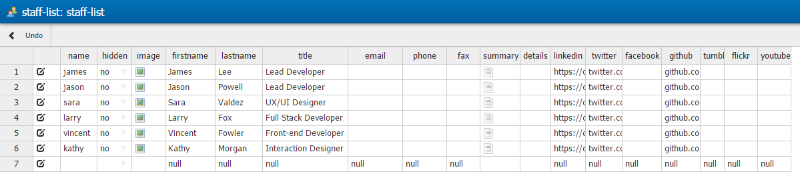
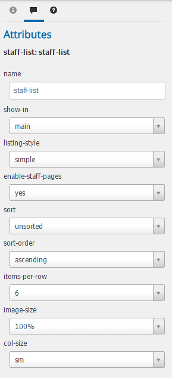

Getting started
===============

Please refer to our [WebPal Developer Guide](https://www.gitbook.com/book/palomino/webpaldev/details) for more information on how to use WebPal extensions

- Writing and extension
- GitHub integration

Staff-list
==========

Plugin for WebPal-powered applications

A staff-list is a list of staff members where all data is kept in an editable table with few options to stylize the layout

Simply add this plugin to your WebPal extensions

Insert a staff-list into a page you are creating

 

Example of how staff-list will look in WebPal:

Check out Attributes for some layout and styling options:

Preview of how staff-list would look like on a webpage:

No need to edit any code; add any preferred CSS styling on top of what's available

Requires Bootstrap 3.3 and FontAwesome 4.5 frameworks