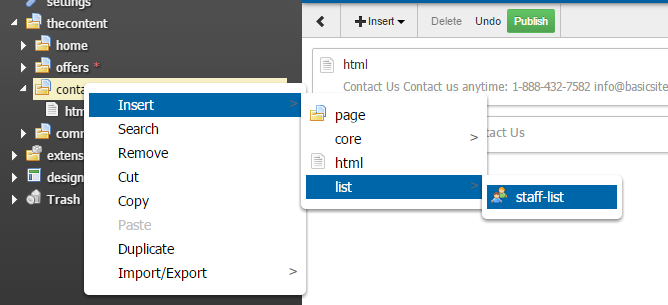

Staff-list
======================================================================

Plugin for WebPal-powered applications

A staff-list is a list of staff members where all data is kept in a table

Simply add this plugin to your WebPal extensions

Insert a staff-list into a page you are creating

No need to edit any code; add any preferred CSS styling on top of what's available

Requires Bootstrap 3.3 and FontAwesome 4.5 frameworks

NOTE: 'extensions-essentials' is required for most WebPal extensions